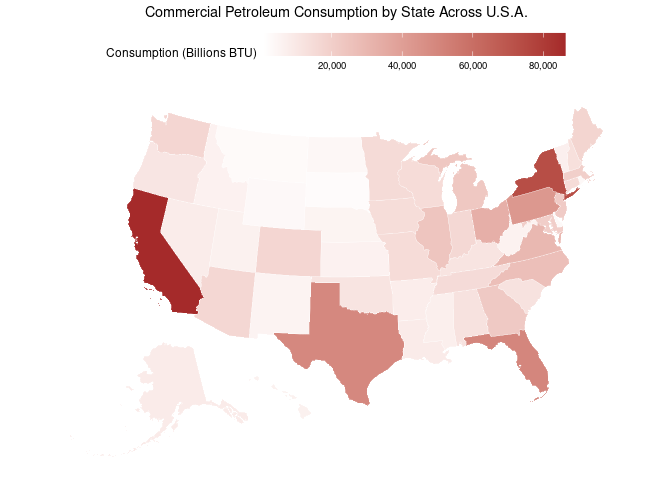

Project memo
================
Group 7

This document should contain a detailed account of the data clean up for
your data and the design choices you are making for your plots. For
instance you will want to document choices you’ve made that were
intentional for your graphic, e.g. color you’ve chosen for the plot.
Think of this document as a code script someone can follow to reproduce
the data cleaning steps and graphics in your handout.

``` r
library(tidyverse)
library(broom)
library(readxl)
library(usmap)
library(ggrepel)
```

## Data Clean Up Steps for Overall Data

### Step 1: Data Cleaning

We loaded, cleaned, and merged the energy and population datasets by
state and included only the data from 2019. We then calculated
per-capita values for all energy-related variables and added those new
columns back into the main dataset.

``` r
setwd("/cloud/project")

energy <- read_csv("data/energy.csv")
```

    ## Rows: 3060 Columns: 84
    ## ── Column specification ────────────────────────────────────────────────────────
    ## Delimiter: ","
    ## chr  (1): State
    ## dbl (83): Year, Production.Coal, Consumption.Commercial.Coal, Consumption.Co...
    ## 
    ## ℹ Use `spec()` to retrieve the full column specification for this data.
    ## ℹ Specify the column types or set `show_col_types = FALSE` to quiet this message.

``` r
filtered_energy <- energy %>%
  filter(Year == 2019) %>%
  select(State, Year, starts_with(c("Consumption", "Expenditure", "Price")))

population <- read_excel("data/Population.xlsx")
```

    ## New names:
    ## • `` -> `...2`
    ## • `` -> `...3`
    ## • `` -> `...4`
    ## • `` -> `...5`
    ## • `` -> `...6`
    ## • `` -> `...7`
    ## • `` -> `...8`
    ## • `` -> `...9`
    ## • `` -> `...10`
    ## • `` -> `...11`
    ## • `` -> `...12`
    ## • `` -> `...13`

``` r
filtered_population <- population[c(-(1:8),-(60:66)),] %>%
  rename(Population = "...13",
         State = "table with row headers in column A and column headers in rows 3 through 4. (leading dots indicate sub-parts)") %>%
  mutate(State = substr(State, 2, nchar(State))) %>%
  select(State, Population)

joined <- filtered_energy %>%
  left_join(filtered_population, by = c("State" = "State"))

variables <- colnames(joined)
variables <- variables[-c(1:2,84)]

per_cap <- joined %>%
  mutate(across(variables, ~ .x / joined$Population))
```

    ## Warning: There was 1 warning in `mutate()`.
    ## ℹ In argument: `across(variables, ~.x/joined$Population)`.
    ## Caused by warning:
    ## ! Using an external vector in selections was deprecated in tidyselect 1.1.0.
    ## ℹ Please use `all_of()` or `any_of()` instead.
    ##   # Was:
    ##   data %>% select(variables)
    ## 
    ##   # Now:
    ##   data %>% select(all_of(variables))
    ## 
    ## See <https://tidyselect.r-lib.org/reference/faq-external-vector.html>.

``` r
for (var in variables) {
  per_cap[[paste0(var, "_pc")]] <- per_cap[[var]]
}

per_cap <- per_cap %>%
  select(State, Year, ends_with("pc"))

final <- joined %>%
  left_join(per_cap, by = c("State" = "State"))

# Print the output of glimpse() or skim()
glimpse(final)
```

    ## Rows: 51
    ## Columns: 166
    ## $ State                                                <chr> "Alaska", "Alabam…
    ## $ Year.x                                               <dbl> 2019, 2019, 2019,…
    ## $ Consumption.Commercial.Coal                          <dbl> 6568, 0, 0, 0, 0,…
    ## $ `Consumption.Commercial.Distillate Fuel Oil`         <dbl> 7309, 4622, 4001,…
    ## $ Consumption.Commercial.Geothermal                    <dbl> 85, 0, 0, 48, 634…
    ## $ Consumption.Commercial.Hydropower                    <dbl> 1161, 0, 0, 0, 12…
    ## $ Consumption.Commercial.Kerosene                      <dbl> 0, 14, 16, 0, 46,…
    ## $ Consumption.Commercial.Petroleum                     <dbl> 8622, 12410, 7852…
    ## $ `Consumption.Commercial.Natural Gas`                 <dbl> 14365, 25570, 558…
    ## $ Consumption.Commercial.Solar                         <dbl> 11, 88, 173, 6909…
    ## $ Consumption.Commercial.Wind                          <dbl> 0, 0, 0, 0, 53, 1…
    ## $ Consumption.Commercial.Wood                          <dbl> 801, 286, 998, 79…
    ## $ `Consumption.Electric Power.Coal`                    <dbl> 11035, 268395, 23…
    ## $ `Consumption.Electric Power.Distillate Fuel Oil`     <dbl> 5016, 167, 449, 7…
    ## $ `Consumption.Electric Power.Natural Gas`             <dbl> 24442, 430679, 16…
    ## $ `Consumption.Electric Power.Wood`                    <dbl> 0, 523, 2761, 380…
    ## $ Consumption.Industrial.Coal                          <dbl> 17, 48785, 4045, …
    ## $ `Consumption.Industrial.Distillate Fuel Oil`         <dbl> 9066, 20177, 1995…
    ## $ Consumption.Industrial.Geothermal                    <dbl> 0, 42, 12, 247, 1…
    ## $ Consumption.Industrial.Hydropower                    <dbl> 0, 0, 0, 0, 0, 0,…
    ## $ Consumption.Industrial.Kerosene                      <dbl> 0, 13, 7, 1, 4, 5…
    ## $ Consumption.Industrial.Petroleum                     <dbl> 37406, 61581, 527…
    ## $ `Consumption.Industrial.Natural Gas`                 <dbl> 297448, 236587, 1…
    ## $ `Consumption.Industrial.Other Petroleum Products`    <dbl> 14609, 17318, 980…
    ## $ Consumption.Industrial.Solar                         <dbl> 0, 9, 30, 123, 19…
    ## $ Consumption.Industrial.Wind                          <dbl> 0, 0, 0, 0, 46, 2…
    ## $ Consumption.Industrial.Wood                          <dbl> 70, 162162, 64256…
    ## $ Consumption.Refinery.Coal                            <dbl> 0, 0, 0, 0, 0, 0,…
    ## $ `Consumption.Refinery.Distillate Fuel Oil`           <dbl> 46, 12, 12, 0, 50…
    ## $ `Consumption.Refinery.Natural Gas`                   <dbl> 3319, 10131, 6476…
    ## $ Consumption.Residential.Coal                         <dbl> 0, 0, 0, 0, 0, 0,…
    ## $ `Consumption.Residential.Distillate Fuel Oil`        <dbl> 6574, 23, 4, 2, 4…
    ## $ Consumption.Residential.Geothermal                   <dbl> 101, 99, 797, 50,…
    ## $ Consumption.Residential.Kerosene                     <dbl> 0, 11, 4, 2, 418,…
    ## $ Consumption.Residential.Petroleum                    <dbl> 6971, 6068, 4103,…
    ## $ `Consumption.Residential.Natural Gas`                <dbl> 17698, 31472, 341…
    ## $ Consumption.Residential.Wood                         <dbl> 5536, 1978, 6899,…
    ## $ Consumption.Transportation.Coal                      <dbl> 0, 0, 0, 0, 0, 0,…
    ## $ `Consumption.Transportation.Distillate Fuel Oil`     <dbl> 36849, 130946, 95…
    ## $ Consumption.Transportation.Petroleum                 <dbl> 162456, 473225, 2…
    ## $ `Consumption.Transportation.Natural Gas`             <dbl> 344, 23824, 7704,…
    ## $ Expenditure.Commercial.Coal                          <dbl> 51.3, 0.0, 0.0, 0…
    ## $ `Expenditure.Commercial.Distillate Fuel Oil`         <dbl> 123.5, 71.2, 63.1…
    ## $ Expenditure.Commercial.Kerosene                      <dbl> 0.0, 0.3, 0.4, 0.…
    ## $ Expenditure.Commercial.Petroleum                     <dbl> 151.7, 205.8, 130…
    ## $ `Expenditure.Commercial.Natural Gas`                 <dbl> 144.1, 295.3, 423…
    ## $ `Expenditure.Electric Power.Coal`                    <dbl> 62.5, 615.3, 463.…
    ## $ `Expenditure.Electric Power.Distillate Fuel Oil`     <dbl> 79.0, 2.5, 6.6, 1…
    ## $ `Expenditure.Electric Power.Natural Gas`             <dbl> 191.3, 1240.4, 42…
    ## $ Expenditure.Industrial.Coal                          <dbl> 0.1, 206.3, 13.4,…
    ## $ `Expenditure.Industrial.Distillate Fuel Oil`         <dbl> 150.0, 334.5, 338…
    ## $ Expenditure.Industrial.Kerosene                      <dbl> 0.0, 0.2, 0.1, 0.…
    ## $ Expenditure.Industrial.Petroleum                     <dbl> 421.0, 868.3, 723…
    ## $ `Expenditure.Industrial.Natural Gas`                 <dbl> 73.6, 818.4, 618.…
    ## $ `Expenditure.Industrial.Other Petroleum Products`    <dbl> 0.0, 103.4, 35.9,…
    ## $ Expenditure.Residential.Coal                         <dbl> 0, 0, 0, 0, 0, 0,…
    ## $ `Expenditure.Residential.Distillate Fuel Oil`        <dbl> 132.5, 0.4, 0.1, …
    ## $ Expenditure.Residential.Kerosene                     <dbl> 0.0, 0.3, 0.1, 0.…
    ## $ Expenditure.Residential.Petroleum                    <dbl> 144.0, 144.3, 92.…
    ## $ `Expenditure.Residential.Natural Gas`                <dbl> 199.4, 478.5, 372…
    ## $ Expenditure.Residential.Wood                         <dbl> 26.7, 6.6, 23.0, …
    ## $ Expenditure.Transportation.Coal                      <dbl> 0, 0, 0, 0, 0, 0,…
    ## $ `Expenditure.Transportation.Distillate Fuel Oil`     <dbl> 909.1, 2662.5, 19…
    ## $ Expenditure.Transportation.Petroleum                 <dbl> 3338.0, 9218.6, 5…
    ## $ `Expenditure.Transportation.Natural Gas`             <dbl> 0.0, 0.6, 0.5, 13…
    ## $ Price.Commercial.Coal                                <dbl> 7.82, 0.00, 0.00,…
    ## $ `Price.Commercial.Distillate Fuel Oil`               <dbl> 16.90, 15.41, 15.…
    ## $ Price.Commercial.Kerosene                            <dbl> 21.53, 22.39, 22.…
    ## $ Price.Commercial.Petroleum                           <dbl> 17.60, 16.58, 16.…
    ## $ `Price.Commercial.Natural Gas`                       <dbl> 10.03, 11.55, 7.5…
    ## $ `Price.Electric Power.Coal`                          <dbl> 5.66, 2.29, 1.97,…
    ## $ `Price.Electric Power.Distillate Fuel Oil`           <dbl> 15.74, 15.13, 14.…
    ## $ `Price.Electric Power.Natural Gas`                   <dbl> 7.83, 2.88, 2.61,…
    ## $ Price.Industrial.Coal                                <dbl> 5.56, 4.23, 3.30,…
    ## $ `Price.Industrial.Distillate Fuel Oil`               <dbl> 16.63, 16.59, 16.…
    ## $ Price.Industrial.Kerosene                            <dbl> 17.91, 14.83, 15.…
    ## $ Price.Industrial.Petroleum                           <dbl> 18.51, 17.67, 16.…
    ## $ `Price.Industrial.Natural Gas`                       <dbl> 5.93, 3.84, 6.17,…
    ## $ `Price.Industrial.Other Petroleum Products`          <dbl> 0.00, 21.12, 20.5…
    ## $ Price.Transportation.Coal                            <dbl> 0, 0, 0, 0, 0, 0,…
    ## $ `Price.Transportation.Distillate Fuel Oil`           <dbl> 24.67, 20.33, 20.…
    ## $ Price.Transportation.Petroleum                       <dbl> 20.55, 19.48, 19.…
    ## $ `Price.Transportation.Natural Gas`                   <dbl> 0.00, 9.25, 8.76,…
    ## $ Population                                           <dbl> 731545, 4903185, …
    ## $ Year.y                                               <dbl> 2019, 2019, 2019,…
    ## $ Consumption.Commercial.Coal_pc                       <dbl> 8.978258e-03, 0.0…
    ## $ `Consumption.Commercial.Distillate Fuel Oil_pc`      <dbl> 0.0099911830, 0.0…
    ## $ Consumption.Commercial.Geothermal_pc                 <dbl> 1.161924e-04, 0.0…
    ## $ Consumption.Commercial.Hydropower_pc                 <dbl> 1.587052e-03, 0.0…
    ## $ Consumption.Commercial.Kerosene_pc                   <dbl> 0.000000e+00, 2.8…
    ## $ Consumption.Commercial.Petroleum_pc                  <dbl> 0.011786015, 0.00…
    ## $ `Consumption.Commercial.Natural Gas_pc`              <dbl> 0.019636523, 0.00…
    ## $ Consumption.Commercial.Solar_pc                      <dbl> 1.503667e-05, 1.7…
    ## $ Consumption.Commercial.Wind_pc                       <dbl> 0.000000e+00, 0.0…
    ## $ Consumption.Commercial.Wood_pc                       <dbl> 1.094943e-03, 5.8…
    ## $ `Consumption.Electric Power.Coal_pc`                 <dbl> 0.0150845129, 0.0…
    ## $ `Consumption.Electric Power.Distillate Fuel Oil_pc`  <dbl> 6.856721e-03, 3.4…
    ## $ `Consumption.Electric Power.Natural Gas_pc`          <dbl> 0.033411478, 0.08…
    ## $ `Consumption.Electric Power.Wood_pc`                 <dbl> 0.000000e+00, 1.0…
    ## $ Consumption.Industrial.Coal_pc                       <dbl> 2.323849e-05, 9.9…
    ## $ `Consumption.Industrial.Distillate Fuel Oil_pc`      <dbl> 0.0123929492, 0.0…
    ## $ Consumption.Industrial.Geothermal_pc                 <dbl> 0.000000e+00, 8.5…
    ## $ Consumption.Industrial.Hydropower_pc                 <dbl> 0.000000e+00, 0.0…
    ## $ Consumption.Industrial.Kerosene_pc                   <dbl> 0.000000e+00, 2.6…
    ## $ Consumption.Industrial.Petroleum_pc                  <dbl> 0.051132876, 0.01…
    ## $ `Consumption.Industrial.Natural Gas_pc`              <dbl> 4.066025e-01, 4.8…
    ## $ `Consumption.Industrial.Other Petroleum Products_pc` <dbl> 1.997006e-02, 3.5…
    ## $ Consumption.Industrial.Solar_pc                      <dbl> 0.000000e+00, 1.8…
    ## $ Consumption.Industrial.Wind_pc                       <dbl> 0.000000e+00, 0.0…
    ## $ Consumption.Industrial.Wood_pc                       <dbl> 9.568789e-05, 3.3…
    ## $ Consumption.Refinery.Coal_pc                         <dbl> 0, 0, 0, 0, 0, 0,…
    ## $ `Consumption.Refinery.Distillate Fuel Oil_pc`        <dbl> 6.288062e-05, 2.4…
    ## $ `Consumption.Refinery.Natural Gas_pc`                <dbl> 0.0045369731, 0.0…
    ## $ Consumption.Residential.Coal_pc                      <dbl> 0, 0, 0, 0, 0, 0,…
    ## $ `Consumption.Residential.Distillate Fuel Oil_pc`     <dbl> 8.986460e-03, 4.6…
    ## $ Consumption.Residential.Geothermal_pc                <dbl> 1.380640e-04, 2.0…
    ## $ Consumption.Residential.Kerosene_pc                  <dbl> 0.000000e+00, 2.2…
    ## $ Consumption.Residential.Petroleum_pc                 <dbl> 9.529147e-03, 1.2…
    ## $ `Consumption.Residential.Natural Gas_pc`             <dbl> 0.0241926334, 0.0…
    ## $ Consumption.Residential.Wood_pc                      <dbl> 7.567545e-03, 4.0…
    ## $ Consumption.Transportation.Coal_pc                   <dbl> 0, 0, 0, 0, 0, 0,…
    ## $ `Consumption.Transportation.Distillate Fuel Oil_pc`  <dbl> 0.050371474, 0.02…
    ## $ Consumption.Transportation.Petroleum_pc              <dbl> 0.22207246, 0.096…
    ## $ `Consumption.Transportation.Natural Gas_pc`          <dbl> 0.0004702376, 0.0…
    ## $ Expenditure.Commercial.Coal_pc                       <dbl> 7.012556e-05, 0.0…
    ## $ `Expenditure.Commercial.Distillate Fuel Oil_pc`      <dbl> 1.688208e-04, 1.4…
    ## $ Expenditure.Commercial.Kerosene_pc                   <dbl> 0.000000e+00, 6.1…
    ## $ Expenditure.Commercial.Petroleum_pc                  <dbl> 2.073693e-04, 4.1…
    ## $ `Expenditure.Commercial.Natural Gas_pc`              <dbl> 1.969804e-04, 6.0…
    ## $ `Expenditure.Electric Power.Coal_pc`                 <dbl> 8.543562e-05, 1.2…
    ## $ `Expenditure.Electric Power.Distillate Fuel Oil_pc`  <dbl> 1.079906e-04, 5.0…
    ## $ `Expenditure.Electric Power.Natural Gas_pc`          <dbl> 2.615013e-04, 2.5…
    ## $ Expenditure.Industrial.Coal_pc                       <dbl> 1.366970e-07, 4.2…
    ## $ `Expenditure.Industrial.Distillate Fuel Oil_pc`      <dbl> 2.050455e-04, 6.8…
    ## $ Expenditure.Industrial.Kerosene_pc                   <dbl> 0.000000e+00, 4.0…
    ## $ Expenditure.Industrial.Petroleum_pc                  <dbl> 5.754943e-04, 1.7…
    ## $ `Expenditure.Industrial.Natural Gas_pc`              <dbl> 1.006090e-04, 1.6…
    ## $ `Expenditure.Industrial.Other Petroleum Products_pc` <dbl> 0.000000e+00, 2.1…
    ## $ Expenditure.Residential.Coal_pc                      <dbl> 0, 0, 0, 0, 0, 0,…
    ## $ `Expenditure.Residential.Distillate Fuel Oil_pc`     <dbl> 1.811235e-04, 8.1…
    ## $ Expenditure.Residential.Kerosene_pc                  <dbl> 0.000000e+00, 6.1…
    ## $ Expenditure.Residential.Petroleum_pc                 <dbl> 1.968437e-04, 2.9…
    ## $ `Expenditure.Residential.Natural Gas_pc`             <dbl> 2.725738e-04, 9.7…
    ## $ Expenditure.Residential.Wood_pc                      <dbl> 3.649810e-05, 1.3…
    ## $ Expenditure.Transportation.Coal_pc                   <dbl> 0, 0, 0, 0, 0, 0,…
    ## $ `Expenditure.Transportation.Distillate Fuel Oil_pc`  <dbl> 1.242712e-03, 5.4…
    ## $ Expenditure.Transportation.Petroleum_pc              <dbl> 0.004562946, 0.00…
    ## $ `Expenditure.Transportation.Natural Gas_pc`          <dbl> 0.000000e+00, 1.2…
    ## $ Price.Commercial.Coal_pc                             <dbl> 1.068970e-05, 0.0…
    ## $ `Price.Commercial.Distillate Fuel Oil_pc`            <dbl> 2.310179e-05, 3.1…
    ## $ Price.Commercial.Kerosene_pc                         <dbl> 2.943086e-05, 4.5…
    ## $ Price.Commercial.Petroleum_pc                        <dbl> 2.405867e-05, 3.3…
    ## $ `Price.Commercial.Natural Gas_pc`                    <dbl> 1.371071e-05, 2.3…
    ## $ `Price.Electric Power.Coal_pc`                       <dbl> 7.737050e-06, 4.6…
    ## $ `Price.Electric Power.Distillate Fuel Oil_pc`        <dbl> 2.151611e-05, 3.0…
    ## $ `Price.Electric Power.Natural Gas_pc`                <dbl> 1.070337e-05, 5.8…
    ## $ Price.Industrial.Coal_pc                             <dbl> 7.600353e-06, 8.6…
    ## $ `Price.Industrial.Distillate Fuel Oil_pc`            <dbl> 2.273271e-05, 3.3…
    ## $ Price.Industrial.Kerosene_pc                         <dbl> 2.448243e-05, 3.0…
    ## $ Price.Industrial.Petroleum_pc                        <dbl> 2.530261e-05, 3.6…
    ## $ `Price.Industrial.Natural Gas_pc`                    <dbl> 8.106132e-06, 7.8…
    ## $ `Price.Industrial.Other Petroleum Products_pc`       <dbl> 0.000000e+00, 4.3…
    ## $ Price.Transportation.Coal_pc                         <dbl> 0, 0, 0, 0, 0, 0,…
    ## $ `Price.Transportation.Distillate Fuel Oil_pc`        <dbl> 3.372315e-05, 4.1…
    ## $ Price.Transportation.Petroleum_pc                    <dbl> 2.809123e-05, 3.9…
    ## $ `Price.Transportation.Natural Gas_pc`                <dbl> 0.000000e+00, 1.8…

### Step 2: Visualizations

### Plot 1: Commercial Petroleum Consumption Map

For this first plot, we started by adding a lowercase state column to
ensure that the data aligns with the mapping package’s format. This plot
then showcases a U.S. map shaded by each state’s commercial petroleum
consumption, using a gradient to highlight differences in energy use.

#### Data cleanup specific to plot 1

``` r
final <- final %>%
  mutate(state = State)
```

#### Final Plot 1

``` r
plot_usmap(
  linewidth = 0.1,
  color = "white",
  regions = "state",
  data = final,
  values = 'Consumption.Commercial.Petroleum'
) +
  scale_fill_gradient(
    labels = scales::label_number(big.mark = ','),
    high = 'steelblue',
    low = 'white'
  ) +
  labs(fill = 'Consumption (Billions BTU)',
       title = "Commercial Petroleum Consumption by State Across U.S.A.") +
  guides(
    fill = guide_colorbar(barwidth = unit(8, 'cm'))
  ) +
  theme(
    legend.position = 'top',
    plot.title = element_text(hjust = 0.5)  # <-- Center the title
  )
```



### Plot 2: Commercial Petroleum Consumption Per Capita Map

This second plot is also a U.S. map but this time it is shaded by each
state’s expenditure of commercial petroleum (how much they spend on the
fuel itself as well as the associated processes), using a gradient to
highlight the differences.

``` r
plot_usmap(
  linewidth = 0.1,
  color = "white",
  regions = "state",
  data = final,
  values = 'Expenditure.Commercial.Petroleum_pc'
) +
  scale_fill_gradient(
    labels = scales::label_number(big.mark = ','),
    high = 'steelblue',
    low = 'white'
  ) +
  labs(fill = 'Consumption (Billions BTU)',
       title = "Commercial Petroleum Consumption by State Across U.S.A.") +
  guides(
    fill = guide_colorbar(barwidth = unit(8, 'cm'))
  ) +
  theme(
    legend.position = 'top',
    plot.title = element_text(hjust = 0.5)  # <-- Center the title
  )
```


### Plot 3: Petroleum Expenditure Per Capita vs Petroleum Dependance

#### Data cleanup specific to plot 3

\#Note: rowSums, grepl, contains, and ends_with are functions for
creating aggreates of multiple variables based on naming conventions
learned from ECON 368 with Professor Kyle Coombs.

``` r
expenditure_plot_data <- final %>%
  mutate(
    total_consumption_pc = rowSums(select(., ends_with("_pc")), na.rm = TRUE),
    
    petroleum_consumption_pc = rowSums(
      select(., contains("Consumption") & contains("Petroleum") & ends_with("_pc")), na.rm = TRUE),
    
    petroleum_dependence = petroleum_consumption_pc / total_consumption_pc,
    
    petroleum_expenditure_pc = rowSums(
      select(., contains("Expenditure") & contains("Petroleum") & ends_with("_pc")), na.rm = TRUE)
  )
```

#### Final Plot 3:

For this third plot, we created a scatterplot with each US state
comparing Petroleum Expenditure Per Capita and Petroleum Dependence. On
the X-axis, we have each state’s consumption of Petroleum shown as the
proportion of their total energy consumption which showcases dependence.
On the Y-axis, we have the Petroleum Expenditure Per Capita for each
state which is how much each state spends on petroleum and the
associated processes.

``` r
expenditure_plot <- ggplot(expenditure_plot_data, aes(x = petroleum_dependence,
                        y = petroleum_expenditure_pc,
                        label = State)) +
  geom_point(size = 3, alpha = 0.8, color = "steelblue") +   # steel blue
  geom_smooth(method = "lm", color = "blue", linewidth = 1, se = TRUE) +
  geom_text_repel(size = 3, color = "black") +
  labs(
    title = "Petroleum Expenditure per Capita vs. Petroleum Dependence",
    x = "Proportion of Total State Consumption of Petroleum",
    y = "Petroleum Expenditure per Capita (USD)"
  ) +
  theme_minimal(base_size = 11.5)

expenditure_plot
```

    ## `geom_smooth()` using formula = 'y ~ x'

    ## Warning: The following aesthetics were dropped during statistical transformation: label.
    ## ℹ This can happen when ggplot fails to infer the correct grouping structure in
    ##   the data.
    ## ℹ Did you forget to specify a `group` aesthetic or to convert a numerical
    ##   variable into a factor?

    ## Warning: ggrepel: 20 unlabeled data points (too many overlaps). Consider
    ## increasing max.overlaps


### Plot 4: Petroleum Price vs. Petroleum Dependance

#### Data cleanup specific to plot 3

``` r
price_plot_data <- final %>%
  mutate(
    total_consumption_pc = rowSums(select(., ends_with("_pc")), na.rm = TRUE),
    
    petroleum_consumption_pc = rowSums(
      select(., contains("Consumption") & contains("Petroleum") & ends_with("_pc")), na.rm = TRUE),
    
    petroleum_dependence = petroleum_consumption_pc / total_consumption_pc,
    
    petroleum_price = rowMeans(
      select(., contains("Price") & contains("Petroleum")), na.rm = TRUE)
  )
```

#### Final Plot 4:

For our fourth and final plot, we created another scatterplot comparing
Petroleum Dependence and Average Petroleum Price with the X-axis again
being the proportion of each state’s consumption that Petroleum occupies
and the Y-axis being the average price of Petroleum for consumers in
each state.

``` r
price_plot <- ggplot(price_plot_data, aes(x = petroleum_dependence,
                        y = petroleum_price,
                        label = State)) +
  geom_point(size = 3, alpha = 0.8, color = "steelblue") +
  geom_smooth(method = "lm", color = "blue", linewidth = 1, se = TRUE) +
  geom_text_repel(size = 3, color = "black") +
  labs(
    x = "Proportion of Total State Consumption from Petroleum",
    y = "Average Petroleum Price (USD per million BTU)"
  ) +
  theme_minimal(base_size = 11.5) +
  theme(
    axis.text = element_text(size = 10.5),
    axis.title = element_text(size = 10.5)
  )

price_plot
```

    ## `geom_smooth()` using formula = 'y ~ x'

    ## Warning: The following aesthetics were dropped during statistical transformation: label.
    ## ℹ This can happen when ggplot fails to infer the correct grouping structure in
    ##   the data.
    ## ℹ Did you forget to specify a `group` aesthetic or to convert a numerical
    ##   variable into a factor?

    ## Warning: ggrepel: 5 unlabeled data points (too many overlaps). Consider
    ## increasing max.overlaps


